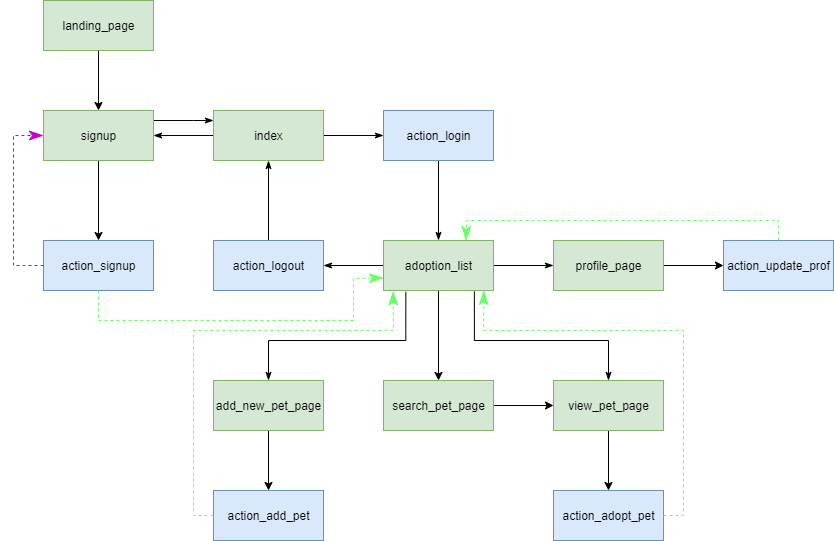
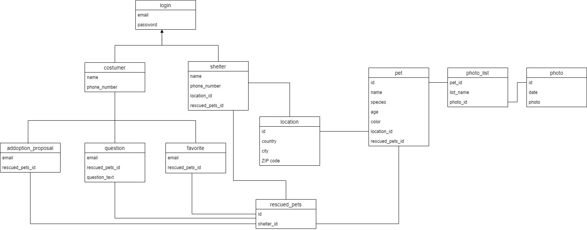

# PHP Life Buddies

PHP website for listing rescued pets for adoption and offer them a forever home.

## Features:
- Security
   - XSS: yes
   - CSRF: yes
   - SQL using prepare/execute: yes
   - Passwords: SHA1
   - Data Validation: regex / php / html / javascript / ajax
   - Other:
     - SQL Constraints
     - Exception handling
     - Session Regeneration
     - Data Cleaning
     - Session/Cookies expiration
- Technologies
   - Separated logic/database/presentation: yes
   - Semantic HTML tags: yes
   - Responsive CSS: yes
   - Javascript: yes
   - Ajax: yes
   - REST API: yes
   - Other:
     - Page template and design consistency
     - Code quality and Code consistency
     - Directory / File organization
     - API Token authentication
- Usability:
  - Simple and intuitive user interface
  - Logical and comprehensive behaviour
  - Error/success messages
  - Login/Register/Create/Update actions for users and pets
  - Diverse searching criteria
  - List pet questions
  - Managing previous posts
  - Make proposals for not adopted pets
  - Different states for the pet adoption process
  - Preview and add multiple photos when creating or updating a pet
  - Diverse notifications on users' actions
  - Rest API for CRUD profile operations and basic actions on pets
 
## Mockups

| Landing Page | Login | Register |
|---|---|---|
|  |  |  |

| Profile Page | New Pet | View Pet |
|---|---|---|
|  |  |  |

| Adoption List | Search Page |
|---|---|
|  |  |

## Navigation

## Database

## Authors:
- Eduardo Brito, [@edurbrito](https://github.com/edurbrito)
- Paulo Ribeiro, [@PJscp16](https://github.com/PJscp16)
- Pedro Ferreira, [@pdff2000](https://github.com/pdff2000)
- Pedro Ponte, [@pedrovponte](https://github.com/pedrovponte)